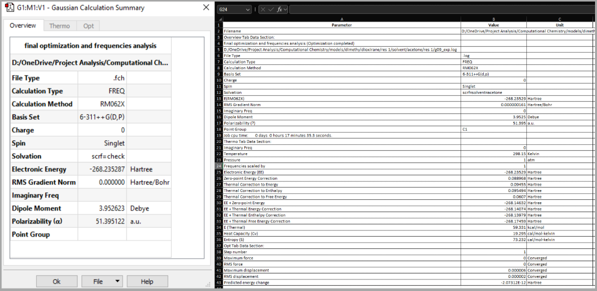
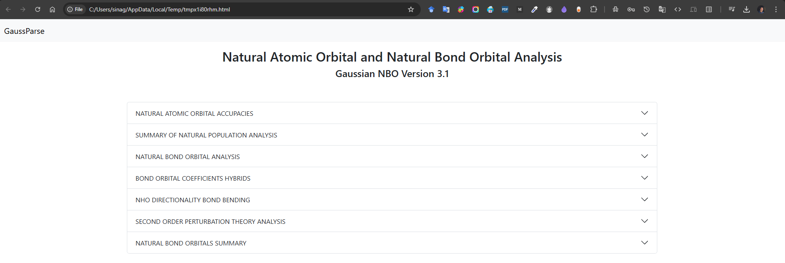

# GaussParse


[](https://pepy.tech/projects/gaussparse)


GaussParse is a versatile Python package designed for parsing output files generated by Gaussian software, a widely used computational chemistry tool. This package enables users to efficiently extract essential information and perform various analytical tasks directly from Gaussian output files. Whether you need to visualize energy profiles, analyze IRC (Intrinsic Reaction Coordinate) curves, retrieve summary results, or extract molecular orientations, GaussParse provides a streamlined interface to accomplish these tasks with ease.

## ✨ Key Features

* 📈 **Energy Profile Plotting**: Visualize and analyze energy profiles directly from Gaussian output files.

* 📉 **IRC Curve Plotting**: Generate plots of IRC curves to study reaction pathways.

* 📊 **Summary Results Extraction**: Extract and summarize key computational results from Gaussian calculations.

* 🧬 **Molecular Orientation Analysis**: Retrieve detailed information about molecular orientations and configurations.

* 📝 **Publication-Ready Data**: Extract molecular orientation data into a Word file formatted for publication as supplementary information.

GaussParse simplifies the process of post-processing Gaussian output, making it an invaluable tool for computational chemists and researchers working in molecular dynamics, quantum chemistry, and related fields.

## 🛠️ Installation

Install this project

```bash
  pip install GaussParse
```

## 📓 Interactive Notebooks with Binder

Try GaussParse directly in your browser without any installation using Binder. Click on any of the following links to launch interactive Jupyter notebooks:

* [IRC Profile Analysis](https://mybinder.org/v2/gh/sinagilassi/GaussParse/HEAD?urlpath=%2Fdoc%2Ftree%2Fnotebook%2Firc-profile.ipynb) - Analyze and plot IRC profiles
* [Energy Profile Analysis](https://mybinder.org/v2/gh/sinagilassi/GaussParse/HEAD?urlpath=%2Fdoc%2Ftree%2Fnotebook%2Fenergy-profile.ipynb) - Create and visualize energy profiles
* [Save XYZ Format](https://mybinder.org/v2/gh/sinagilassi/GaussParse/HEAD?urlpath=%2Fdoc%2Ftree%2Fnotebook%2Fsave-xyz.ipynb) - Convert Gaussian output to XYZ format
* [Summary Result to Excel](https://mybinder.org/v2/gh/sinagilassi/GaussParse/HEAD?urlpath=%2Fdoc%2Ftree%2Fnotebook%2Fsummary-result.ipynb) - Generate summary result tables in Excel
* [Transform XYZ Format](https://mybinder.org/v2/gh/sinagilassi/GaussParse/HEAD?urlpath=%2Fdoc%2Ftree%2Fnotebook%2Ftransform-xyz.ipynb) - Transform to XYZ format used by other computational software

Binder allows you to:

* Experiment with GaussParse functionality in a live environment
* Run example notebooks with sample data
* Learn how to use the package through interactive examples

## 🚀 Usage Example

### 📥 Import GaussParse

```python
import GaussParse as gp
```

### 📂 Collect `txt` & `log` Files

Use `template.xlsx` to collect all files (*.txt & *.log) in one folder. Sheet1 contains all Gaussian result files (*.log), for instance, g09_exp.log. Sheet2 also contains all Gaussian result file (*.txt), for instance, g09_exp.txt

```python
# excel file
xls_file = r'template.xlsx'

# collect log
gp.collect_files_from(xls_file, sheet_name="Sheet1")
# collect txt
gp.collect_files_from(xls_file, sheet_name="Sheet2")
```

### 📊 Convert Result Summary to Excel

Convert Gaussian result summary (`GaussView 6.0.16`) to excel, check the sample file (`1,2LO.txt`).

```python
# file
gaussian_log = "1,2LO.txt"
# save in excel
gp.result_summary_to_excel(gaussian_log)
```




### 🔄 Convert Result Summary to Pandas DataFrame

Convert Gaussian result summary (`GaussView 6.0.16`) to dataframe, check the sample file (`1,2LO.txt`).

```python
# file
gaussian_log = "1,2LO.txt"
# save in excel
gp.result_summary_to_dataframe(gaussian_log)
```

### 📝 Convert Input Orientation to Text Format

Input orientation including `center number`, `atomic number`, `atomic symbol`, and `coordinates (X,Y,Z)` are all extracted and saved in a text file.

```python
# folder
gaussian_log = r"...\\folder-1"
# save in txt
gp.input_orientation_to_txt(gaussian_log)

# log file
gaussian_log = r"acetone.log"
# save in txt
gp.txt_orientation_to_xyz(gaussian_log)
```

### 📈 Plot IRC Profile

Check `irc.log`,

```python
# file path
plt_data = "irc.log"
# save IRC profile
gp.plot_irc_profile(plt_data)

```


### 📉 Plot Energy Profile

Check `energy.xlsx`, then load data in an excel file.

```python
# file path
plt_data = 'energy.xlsx'
# plot energy profile and save it
gp.plot_energy_profile(plt_data)
```


### 🌐 NBO Parser

Display Gaussian NBO results in the browser

Check `nbo.log`,

```python 
# file
nbo_file = "nbo.log"
# display
gp.nbo_parser(nbo_file)
```



For a quick analysis without installing the package, you can use our online web application:

[https://gaussnbo.up.railway.app/](https://gaussnbo.up.railway.app/)

This web interface allows you to:

* Upload your Gaussian NBO log files
* Analyze NBO data directly in your browser
* Visualize results without any local installation

## 📜 License

[MIT](https://choosealicense.com/licenses/mit/)

## 📚 Citation

If you use this Python package in your research, please cite it as follows:

Sina Gilassi, (2024). GaussParse: A Python package for parsing Gaussian software output. GitHub repository. https://github.com/sinagilassi/GaussParse

## ❓ FAQ

For any question, contact me on [LinkedIn](https://www.linkedin.com/in/sina-gilassi/)

## 👥 Authors

- [@sinagilassi](https://www.github.com/sinagilassi)